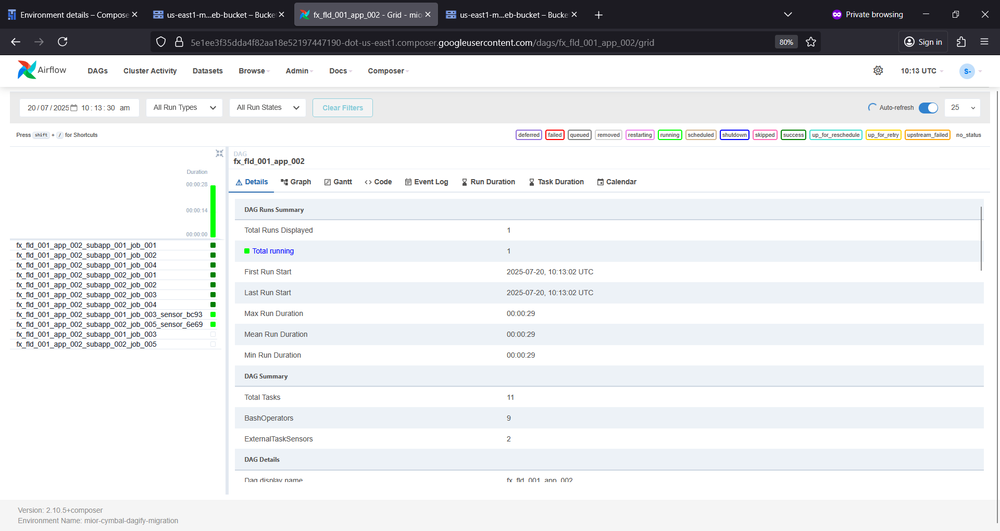

# controlmdag Ⓜ️🗡️
controlmdag : BMC Control-M Migration # Control M # Apache Airflow # DAGify # Composer

## Objective
- Create a Cloud Composer 3 environment
- Download and configure DAGify
- Use DAGify to convert Control-M export files into a Python native DAG
- Deploy DAGs to the Cloud Composer environment
- Make modifications to the DAGify configuration and templates

## DAGify Migration (Control-M to Apache Airflow)  

